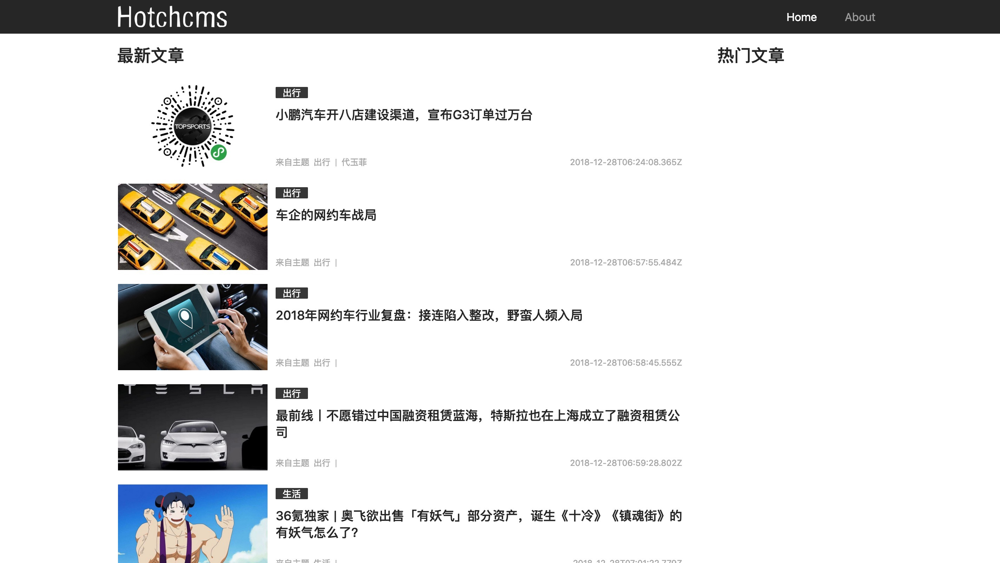
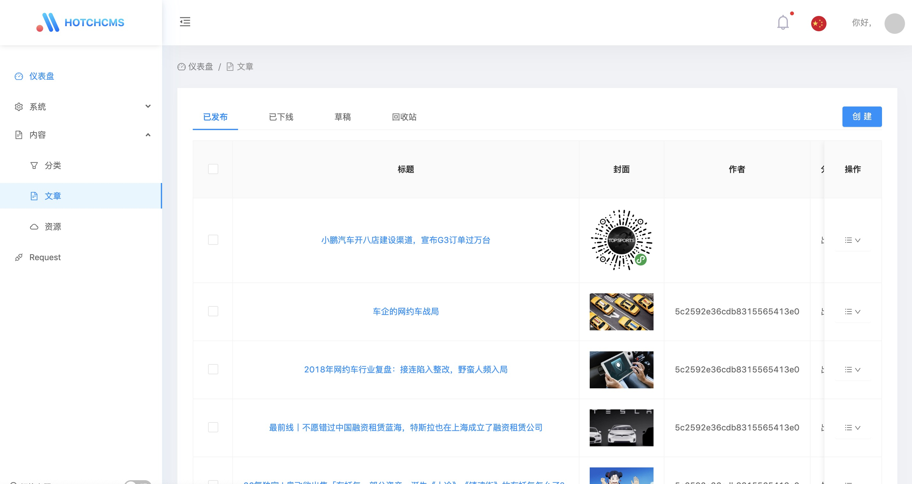
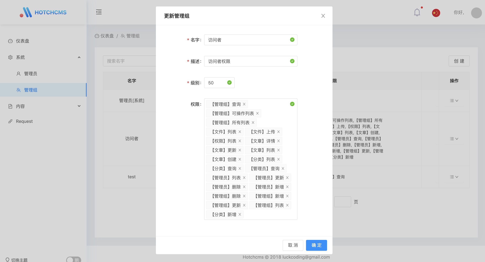

# Hotchcms

前后端分离的cms建站系统.

> 迭代中

* 前台展示

* 后台展示

## 服务端

### 技术栈

* 服务 `koa2`
* 数据库 `mongoose`
* 缓存 `redis`
* 路由 `koa-router`
* token验证 `jsonwebtoken`
* 权限 `koa-authority`
* 参数验证 `koa-middle-validator`
* 日志 `tracer`
* 测试  `mocha` `supertest`

### 安装

#### 方法1. Docker

1. 修改配置文件 `config/setting.js`。`mongodb.host = localhost` 修改为 `mongodb.host = mongodb`，`redis.host = localhost` 修改为 `redis.host = redis` *(修改值为 docker-compose.yml 文件内配置的地址)*
2. 安装容器 `$ docker-compose up`
3. 进入 **Node** 容器 `$ docker exec -it NodeContainerId /bin/bash`
4. **Node** 容器内执行初始化数据 `$ npm run init`

#### 方法2. 常规

1. 安装 `mongodb^v3.0+`, `redis^v4.0+` `node^v8.0+`
2. 修改 `config/setting.js` 配置
3. `$ npm install` 安装依赖
4. `$ npm start` 启动生产环境
5. `$ npm run init` 初始化数据 (首次安装时执行)

## 管理台

### 技术栈

[antd-admin](https://github.com/zuiidea/antd-admin)

### 安装

1. 修改 `src/utils/config.js` 文件内 `BASE_URL` 为后端接口地址
2. `$ npm run build` 打包
3. `$ npm start` 生产环境启动

## 客户端

### 技术栈

* 基础框架 `react` `next.js`
* 服务端 `express`
* 数据层 `redux` `redux-saga` `immutable`
* 请求 `isomorphic-unfetch`
* 样式 `styled-components`

### 安装

1. 修改 `helpers/config.js` 文件内 `BASE_URL` 等配置
2. `$ npm run build` 打包

## LICENSE

MIT License

Copyright (c) 2018 mai血过年

Permission is hereby granted, free of charge, to any person obtaining a copy
of this software and associated documentation files (the "Software"), to deal
in the Software without restriction, including without limitation the rights
to use, copy, modify, merge, publish, distribute, sublicense, and/or sell
copies of the Software, and to permit persons to whom the Software is
furnished to do so, subject to the following conditions:

The above copyright notice and this permission notice shall be included in all
copies or substantial portions of the Software.

THE SOFTWARE IS PROVIDED "AS IS", WITHOUT WARRANTY OF ANY KIND, EXPRESS OR
IMPLIED, INCLUDING BUT NOT LIMITED TO THE WARRANTIES OF MERCHANTABILITY,
FITNESS FOR A PARTICULAR PURPOSE AND NONINFRINGEMENT. IN NO EVENT SHALL THE
AUTHORS OR COPYRIGHT HOLDERS BE LIABLE FOR ANY CLAIM, DAMAGES OR OTHER
LIABILITY, WHETHER IN AN ACTION OF CONTRACT, TORT OR OTHERWISE, ARISING FROM,
OUT OF OR IN CONNECTION WITH THE SOFTWARE OR THE USE OR OTHER DEALINGS IN THE
SOFTWARE.
