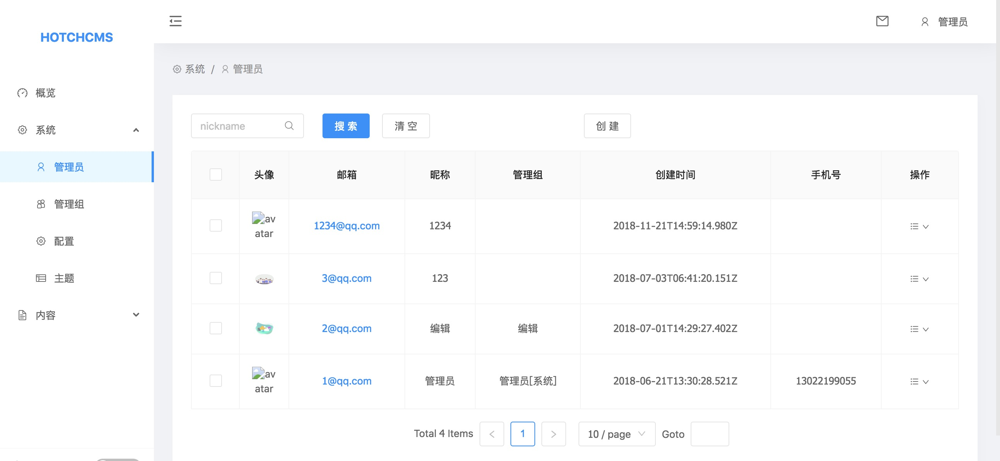
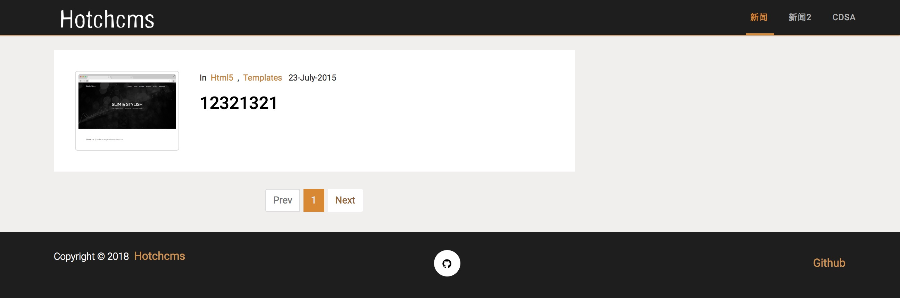
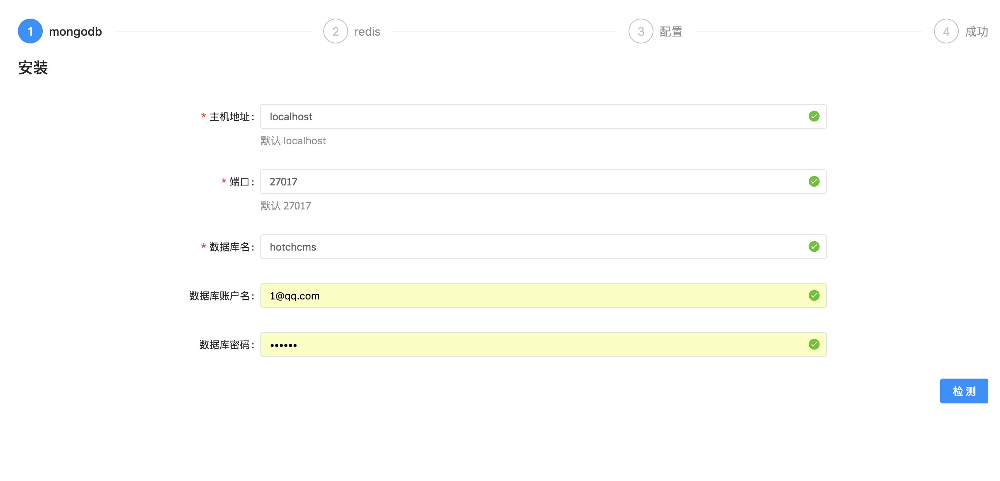

# Hotchcms

使用koa、mongoose、redis、react、antd、dva开发一套一键安装式的cms系统。

## 预览

### 管理平台

### 主题

> 主题文件仅供学习参考

## 启动

`$ git clone https://github.com/luckcoding/hotchcms.git`

### 服务端

`$ mongod && redis-server`

`$ cd server && npm install && npm start`

### 管理平台

`$ cd backstage && npm install && npm run build && npm start`

### 安装

浏览器打开管理平台安装地址*(默认: `http://localhost:8000/install`)*，进入安装界面，如下图

### 主题安装

管理平台导入 `source/default.zip` 文件即可

## Update

### 2018-06-24

* 更新项目结构
* 管理平台框架升级
* 服务端增加资源上传模块

### 2017-09-06

* 增加系统安装流程
* 初始化主题模块
* 优化项目结构
* 优化一些代码
* 修复一些bug

### 2017-08-24

* del koa-jwt
* 初始化 ejs 前端框架
* 增加内容分类
* 优化一些代码
* 修复一些bug

### 2017-08-6

* cookie => jwt
* 增加redis缓存
* 路由优化
* 权限优化
* 修复一些bug

### 2017-06-28

* 增加权限模块
* 增加管理台工程
* 优化项目目录
* 修复一些bug

### 2017-04-9

* 增加管理员模块
* 增加管理员组模块
* 支持站点信息查询

### 2017-03-22

* 支持检测数据库
* 支持初始化数据库
* 测试验证码模块
* 支持管理员登录、退出
* 需手动配置mongo